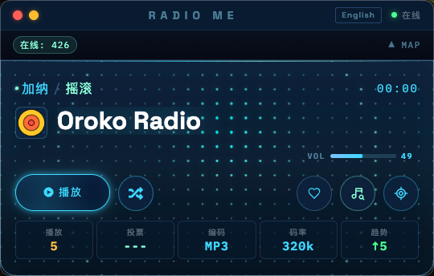
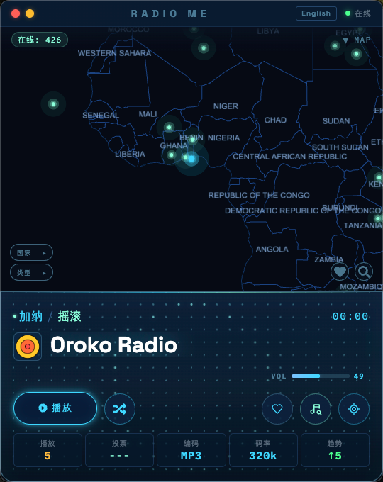

# Local Radio

一个基于 Electron、Vite 和 React 的本地桌面电台播放器。

> 一个纯本地数据驱动的桌面电台应用模板，适合继续开发、私有部署或公开开源维护。

## 应用预览

<p align="center">
  
  
</p>

## 快速开始

首次拉取代码后先安装依赖：

```bash
npm install
```

启动桌面开发环境：

```bash
npm run electron:dev
```

构建应用：

```bash
npm run build
```

打包桌面应用：

```bash
npm run electron:build
```

如果只需要单平台打包，也可以使用：

```bash
npm run electron:build:mac
npm run electron:build:win
```

## 开源说明

本项目以 MIT License 开源发布。

这意味着你可以：

1. 自由使用、复制、修改和分发代码。
2. 将它用于个人项目、商业项目或内部工具。
3. 在保留许可证文本的前提下发布你的修改版本。

你需要注意：

1. 项目按“原样”提供，不附带任何明示或暗示担保。
2. 再分发时需要保留 [LICENSE](LICENSE) 文件中的版权与许可声明。

## 仓库结构

```text
docs/screenshots/          README 顶部预览图
electron/                  Electron 主进程与 preload
public/data/               本地电台快照文件
public/geo/                地图 GeoJSON 数据
src/                       React 渲染进程源码
src/components/            UI 组件
src/hooks/                 地图和动效 hooks
src/services/              本地数据读取与转换服务
src/store/                 Zustand 全局状态
```

## 本地数据文件

应用默认读取：

```text
public/data/radio-snapshot.json
```

仓库默认附带一份可直接运行的本地快照数据；如果你要替换为自己的本地数据，只需要保持同样的 JSON 顶层结构即可。下面是结构示例：

```json
{
	"snapshot_version": 1,
	"generated_at": "2026-05-09T00:00:00.000Z",
	"meta": {
		"total_stations": 120,
		"default_lang": "zh",
		"detail_failures": 0
	},
	"filters": {
		"continents": [],
		"genres": [],
		"countries": [],
		"vibes": []
	},
	"stations": [
		{
			"station_uuid": "example-station",
			"name": "Example Radio",
			"stream_url": "https://example.com/live.mp3"
		}
	]
}
```